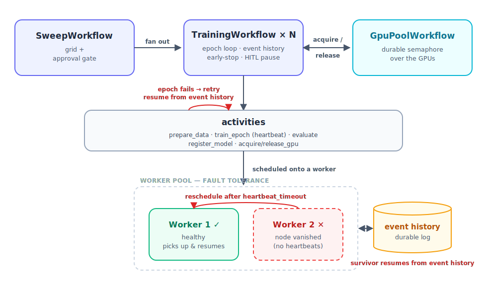

# Durable Training on Temporal

<p align="center">
  <video src="https://github.com/user-attachments/assets/19a4f86b-e5b4-42ca-a350-a246bf9f5236" autoplay loop muted playsinline controls width="80%"></video>
</p>

A customer-demo project showing **Temporal as the orchestration layer for ML
training**: your training loop as durable code — fault-tolerant, GPU-efficient,
cyclic, observable, and human-gated — without a black-box ML platform.

It maps to the four agenda goals plus human-in-the-loop:

1. **Improve GPU utilization & research efficiency** — a Temporal-native GPU pool
   leases scarce GPUs to many jobs; a hyperparameter sweep keeps them saturated.
2. **Build complex pipelines with higher durability than black-box alternatives** —
   the epoch loop, early-stopping, and checkpoint policy are *your* code.
3. **Increase stability, repeatability, visibility for free** — the Temporal UI is
   the experiment dashboard; deterministic replay gives repeatability.
4. **Create cyclic, reusable ML Ops pipelines** that DAGs/state machines can't —
   epoch loops, sweeps, and a durable human-approval gate.

> See [SPEC.md](SPEC.md) for the full design and how it borrows from / improves on
> the [reference sample](https://github.com/samingbar/temporal-ml-ops-samples).

## Architecture

<p align="center">
  
</p>

- **Workflows** (`src/durable_training/workflows/`) are deterministic orchestration.
- **Activities** (`src/durable_training/activities/`) do all ML/IO. Training runs
  through a `TrainerBackend` — a deterministic **simulator** (default, no GPU/deps)
  or a real **PyTorch** backend (`pip install -e ".[torch]"`), selected by config.
- The shared GPU pool is driven from **broker activities** because workflows can't
  synchronously call updates on other workflows.

## Setup

Uses [uv](https://docs.astral.sh/uv/) for environment + dependency management.

```bash
# 1. Temporal CLI (https://docs.temporal.io/cli)
brew install temporal

# 2. uv (https://docs.astral.sh/uv/getting-started/installation/)
brew install uv          # or: curl -LsSf https://astral.sh/uv/install.sh | sh

# 3. Python env (creates .venv and installs the project)
uv sync --extra dev --extra dashboard    # add --extra torch for the real backend
```

`uv run <cmd>` runs a command inside the project env (no manual activation needed).

## Dashboard

A real-time React dashboard whose every panel is powered by Temporal Queries /
Visibility — best shown *side-by-side* with the Temporal Web UI ("the pretty view,
and the durable engine driving it").

```bash
# One command: starts Temporal (if not already running), the API bridge, and the
# SPA dev server. Open http://localhost:5173. Ctrl-C tears it all down.
./run.sh
```

Or run the pieces yourself:

```bash
uv run uvicorn dashboard.api.main:app --port 8000   # API bridge on :8000

# SPA dev server — open this one in your browser
cd dashboard/web && npm install && npm run dev   # dashboard at http://localhost:5173
```

> The UI proxy can also be run standalone: `uv run python -m dashboard.api.ui_proxy`.
> Avoid `--reload` on the API: the reloader's subprocess model can leave the proxy
> port bound. Run without it (or run the proxy standalone) during development.

The dashboard shows the **GPU pool grid** lighting up under contention, **live
loss/accuracy curves** per run, a **recovery banner** when an epoch is retried, a
**sweep leaderboard**, and the **human approval card** (Approve/Reject → signals the
workflow). Buttons in the header start runs/sweeps so you can demo without the CLI.

The GPU panel's **+ / −** buttons resize the pool *live* (a `resize` signal to the
running `GpuPoolWorkflow`) — add a GPU while jobs are queued and watch a waiting job
acquire it instantly, no restart and no dropped leases. Shrinking only removes idle
GPUs, never one a job is using.

The **Worker Pool** panel lists every worker polling the task queue (via Temporal's
`describe_task_queue` poller info), cross-checked against the OS process table
(`ps`) for true liveness — so a killed worker drops within ~1s instead of lingering
the ~minute Temporal's poller info takes to age out. **+ Add worker** spawns a new
worker process on the host; for dashboard-spawned workers a **kill** button stops
one — kill it mid-training and watch its work reschedule onto the survivors and
resume from the last checkpoint (the node-failure story, driven entirely from the UI).

For a single-bundle deploy, `cd dashboard/web && npm run build`; the API then serves
the built SPA at `http://localhost:8000`.

## Run the demos

In separate terminals:

```bash
temporal server start-dev                       # Temporal + Web UI at http://localhost:8233
uv run python -m durable_training.worker        # one worker
# ...or a pool of workers (needed for the node-failure demo):
uv run python scripts/run_workers.py 2          # 2 worker processes; prints their PIDs
```

Then run any demo:

```bash
uv run python scripts/demo_fault_tolerance.py   # crash mid-epoch → resume from checkpoint
uv run python scripts/demo_node_failure.py      # node vanishes → reschedule to another worker
uv run python scripts/demo_gpu_pool.py          # 6 jobs, 2 GPUs → pool stays saturated
uv run python scripts/demo_sweep.py             # hyperparameter sweep → best model auto-promoted
uv run python scripts/demo_human_in_the_loop.py # sweep → approval gate → approve/reject
```

**Two flavors of fault tolerance:**
- *Crash / retry in place* (`demo_fault_tolerance.py`) — an epoch raises; Temporal
  retries it on the same worker and resumes from the last checkpoint.
- *Node disappears* (`demo_node_failure.py`) — the worker's host goes silent (no
  heartbeats). After `heartbeat_timeout`, Temporal reschedules the activity onto
  *another* worker in the pool, which resumes from the checkpoint. For the full
  effect, run 2+ workers and `kill -9` one mid-training — the survivor picks it up.

The dashboard's header buttons start runs for both (**+ Run with injected crash**,
**+ Run with node vanish**); the recovery banner flashes on the reschedule.

## Tests

```bash
uv run pytest        # spins up a local Temporal test server automatically
```

Covers: training completes & improves; **crash mid-epoch resumes from checkpoint**;
GPU pool FIFO lease/release + blocking; sweep picks the best model; HITL pause &
resume; and approval/rejection gating registration.

## Key files

| Path | What |
|------|------|
| `src/durable_training/workflows/training.py` | epoch loop, checkpoints, early-stop, HITL pause, continue-as-new |
| `src/durable_training/workflows/gpu_pool.py` | durable GPU semaphore (acquire/release/utilization) |
| `src/durable_training/workflows/sweep.py` | sweep + human-approval gate |
| `src/durable_training/activities/training.py` | prepare_data, train_epoch (heartbeats), evaluate, register_model |
| `src/durable_training/activities/backends/` | sim + torch training backends |
| `dashboard/api/main.py` | FastAPI bridge over Temporal queries/visibility |
| `dashboard/web/` | React + Vite + Tailwind dashboard |
```
